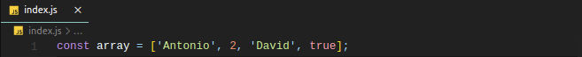
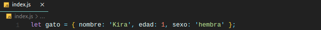
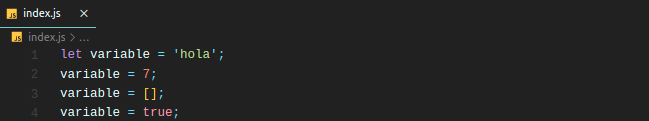
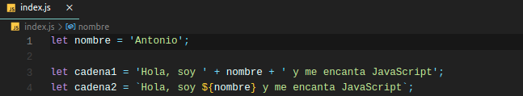
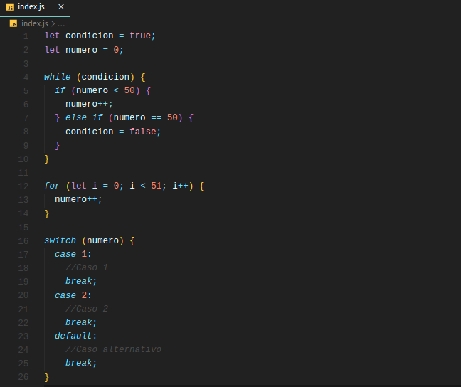
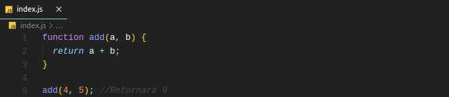

# JavaScript

Antes de entrar a ver todas las ventajas y funcionalidades que nos aporta el uso de TypeScript, vamos a repasar las bases de JavaScript para entender bien el funcionamiento básico de este lenguaje.

## Variables

Una de las carácterísticas más peculiares de JavaScript es que es un lenguaje con un tipado débil. Para entender esto, pongamos el ejemplo de C++. En este lenguaje, al declarar una variable le estamos infiriendo el tipo de dato automáticamente. Por ejemplo, al escribir `int a` estamos **declarando** la variable `a` y a su vez le estamos dando un **tipo** (entero). Por el contrario, en JavaScript esto no ocurre.

En JavaScript cuando declaramos una variable no le indicamos el tipo de esta. Para declararlas utilizaremos 2 palabras clave:

- `const` para constantes
- `let` para variables

Si declaramos una variable como `const` y después la intentamos modificar, nos daría error.

!!! warning

    También podemos declarar variables con la palabra reservada `var`. Esto ya no se hace actualmente, ya que permitía redeclarar variables y utilizar variables antes de que estas fueran declaradas, entre otras cosas.

    Desde ES6 esta forma de declarar variables se considera obsoleta, no habiendo razón ninguna para no utilizar `let` y `const` en vez de `var`.

### Tipos de variables

Si bien no indicamos el tipo de dato que tomará la variable, internamente posee un tipo. Este puede ser:

- Número `number`: A diferencia de lenguajes como C o C++, no existen enteros y flotantes, sino que todos los números se tratan igual.
- Cadena `string`: Cadenas de texto.
- Booleano `boolean`: Pueden tomar el valor `true` o `false`.
- Arreglo `array`: En algunos lenguajes llamado vector, un arreglo contiene múltiples valores encapsulados entre corchetes y separados por comas. Se pueden guardar datos de distinto tipo en un array.

  

- Objeto `object`: En JavaScript, un objeto es un tipo de dato el cual podríamos decir que está compuesto a su vez por varios datos distintos. Por ejemplo, podemos pensar en un objeto `Gato`, el cual tiene los atributos `nombre`, `edad` y `sexo`.

  

También cabe destacar que este lenguaje posee un **tipado dinámico**, es decir, una variable puede tomar valores de distinto tipo sin que esto cause ningún tipo de error.

## Operadores y comillas

No vamos a ver todos los operadores que soporta JavaScript ya que, si lo hicieramos, el taller sería eterno. Pero si que vamos a ver uno muy interesante que no está soportado por algunos lenguajes como C++: el triple igual `===`.

Este operador nos ayuda a comparar datos como el operador `==`. ¿Cuál es la diferencia? El triple igual devolverá `true` cuando estemos comparando dos datos que sean iguales **y del mismo tipo**, cosa que no ocurre con el doble igual. Si los datos que estamos comparando tienen el mismo valor pero no el mismo tipo, `===` nos devolverá `false`.

Algunos operadores también los podemos utilizar para trabajar con cadenas, como por ejemplo el operador `+`. Podemos concatenar cadenas con variables utilizando este operador, aunque esto no es recomendable. Para ello, se utilizan las comillas ` `` `, también llamadas **plantillas literales**. Estas nos permiten incrustar expresiones y variables dentro de nuestras cadenas, además de poder utilizar cadenas de más de una línea, entre otras cosas. Para añadir a nuestra cadena una variable, hacemos uso de un marcador, representado con `${variable}`. Esta última forma es mucho mejor que concatenar cadenas con el signo de la suma, ya que nos aporta mucha más flexibilidad.

## Bucles y condicionales

La sintaxis tanto de los condicionales como de los bucles en este lenguaje es bastante simple. Existen los `if`, `else`, `else if`, `switch`, `while` y `for`.

Sin embargo, existe un tipo de bucle que no todos los lenguajes poseen y que puede resultar muy interesante, el cual nos ayuda a recorrer elementos dentro de, por ejemplo, un array. Para ello, hacemos uso de la palabra reservada `in`. Con el ejemplo que se muestra a continuación, mostraríamos por pantalla uno a uno los elementos del array `array`.

## Funciones

En JavaScript, las funciones se declaran con la palabra clave `function`. Al igual que con las variables, declaramos la función pero no el tipo de dato que esta va a devolver.

También, este lenguaje nos permite guardar estas funciones en variables, las cuales podemos utilizar posteriormente en el código para llamar a la función. El código que se muestra a continuación muestra 2 formas identicas de declarar una función `add`.

Hay infinidad de características de las funciones en JavaScript que no veremos en este taller ya que son más específicas (palabra clave `arguments`, ámbito de las variables, funciones anidadas, parámetros por defecto, etc.). Lo que sí veremos son las cada vez más usadas **funciones flecha**.

Estas funciones poseen una sintaxis que puede ser un poco confusa al principio, pero se utilizan de la misma forma y nos ayudan a escribir menos código de una forma más intuitiva. Consisten en eliminar la palabra clave `function`, haciendo uso de la flecha `=>`. En el ejemplo de abajo, también se muestra el caso en el que nuestra función simplemente devuelve un valor, por lo que podemos expresar la función en una sola línea y sin `return`.

