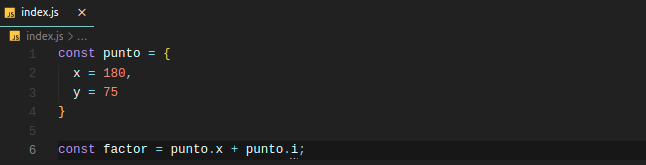
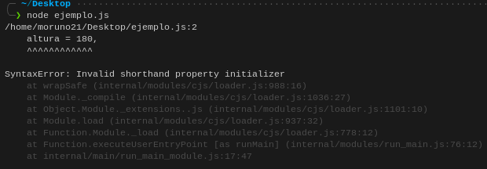
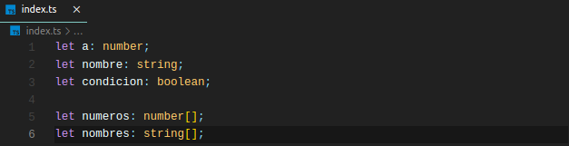
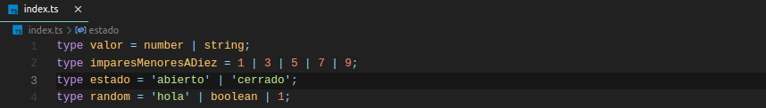
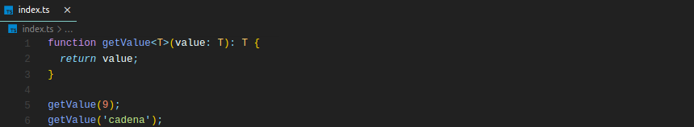

# TypeScript

Ahora sí, vamos a profundizar en por qué TypeScript es cada vez más usado y en cuales son sus principales ventajas.

## Inconvenientes de JavaScript

Imaginemos el siguiente código JavaScript, donde accedemos a la propiedad `i` del objeto `punto`, la cual no existe. Vemos que JavaScript nos informa de que "puede que la propiedad `i` no exista" y es cuando ejecutamos el código cuando nos damos cuenta de que tenemos un error.

En TypeScript esto es totalmente distinto, ya que nos informa de antemano de que tenemos un error, no haciendo falta ejecutar el código para darnos cuenta.

Aún así, aunque JavaScript no nos muestre el error de forma tan flagrante, no sería necesario usar TypeScript para darnos cuenta de este, ¿no?.

Bueno, pongamos el ejemplo de que es una función la que recibe un punto, y que dentro de esa funcion accedemos a los parámetros de esta variable.

Vemos que perfectamente podemos acceder a campos de un objeto que no existen, sin que JavaScript nos muestre ningún error. Cuando llamemos a esta función en nuestro código y le pasemos un dato `punto`, obtendremos el error. Puede que en este caso sea un error fácil de entender y de corregir, pero imaginemos que esto nos ocurre en un proyecto grande, con numerosos ficheros todos ellos de cientos de líneas de código. Obtendremos errores inesperados que muchas veces serán muy difíciles de encontrar debido a problemas como este. Es ahí donde TypeScript marca la diferencia.

## Tipado: La gran ventaja de TypeScript

Por defecto, al crear variables en JavaScript, no tienen ningún tipo. Aunque esto no es del todo cierto. Estas son del tipo `any`, lo cual tiene sentido, ya que podemos igualar una variable a **cualquier** tipo de dato.

Este es el motivo por el que podemos obtener errores como los mostrados en los ejemplos anteriores. Para evitarlos, hacemos uso de la gran característica de TypeScript: el tipado.

No hemos parado de ver durante el taller que, al crear variables y funciones en JavaScript, nunca se especifica el tipo de dato que estas tendrán. Esto nos aporta flexibilidad, pero nos arriesgamos a obtener errores inesperados, los cuales serían muy fáciles de detectar si usáramos TypeScript.

Para indicar el tipo de dato que tendrá una variable, utilizamos el símbolo `:`, acompañado del tipo de dato en cuestión.

Para las funciones es exactamente igual, otorgando un tipo tanto a los argumentos como a la propia función.

## Interfaces

Las interfaces pueden ser entendidas como estructuras las cuales especifican un "contrato". Este contrato debe de ser cumplido por todas las variables que quieran utilizarla como "modelo". Veamos un ejemplo.

Imaginemos que queremos crear una función que solo reciba una variable de tipo `Persona`. Este objeto tendrá las propiedades `nombre`, `edad` y `altura`. Además, queremos que cuente con otro parámetro `estado` que sea opcional. Para asegurarnos de que la función pueda recibir solamente objetos de este tipo, definimos la interfaz `Persona` haciendo uso de la palabra clave `interface`.

¿Qué ventajas nos da esto? Pues que la función `datosPersona` recibirá **sí o sí** como parámetro un objeto de tipo `Persona`. Si este objeto no fuera de ese tipo, obtendríamos el error **en tiempo de desarrollo**, lo cual nos evita obtener errores inesperados en tiempo de ejecución. También podemos utilizar interfaces para, por ejemplo, crear arrays de objetos del tipo que nosotros deseemos.

## Uniones de tipo

Las uniones de tipo son una forma de declarar que una variable u objeto puede ser de más de un tipo. Para ello haremos uso de `type` y de `|`.

Si ahora quisiéramos declarar una variable del tipo `estado` el cual acabamos de crear, esta solo puede tomar 2 valores: `'abierto'` o `'cerrado'`. Lo mismo ocurre con los demás tipos que hemos definido.

## Generics

Los generics en TypeScript (en español genéricos) son construcciones disponibles en lenguajes como Java y C++, pero no en otros como JavaScript. Estos nos ayudan a, entre otras cosas, definir "plantillas" que nos ahorren escribir código duplicado. Veamos esto con un ejemplo.

Imaginemos que queremos crear la función `getValue`, la cual nos retorne un valor, una para que nos devuelva un `number` y otra que nos devuelva un `string`. Para ello tenemos varias opciones:

- Definir una función para cada caso, lo cual no es lo óptimo ya que tendríamos código duplicado.
- Definir tanto la función como el parémtro de tipo `any`, lo cual es posible en TypeScript. Esta opción tampoco es la mejor, ya que perderíamos toda la ayuda en tiempo de desarrollo que nos ofrece el lenguaje, pudiendo obtener errores inesperados en tiempo de ejecución.
- Utilizar generics, lo cual es la mejor alternativa. En nuestro caso utilizaremos el tipo de dato `T` La sintaxis de estos consiste en declararlo de la siguiente forma: `<T>` siendo **T** el tipo de dato "genérico" que va a tratar nuestra función.

